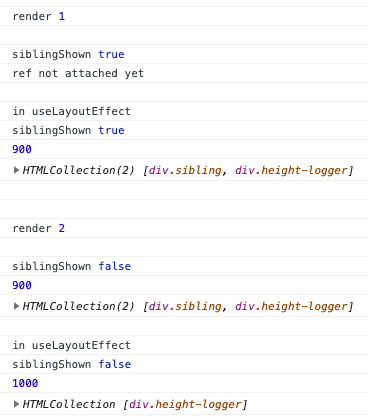

# flex-grow test

Showing how React HTML element refs can lead to incorrect measurements if used improperly.


### How to run
```
yarn && yarn start
```
Then open the developer console on the page that's opened in your browser.


### Wut



The component tree consists of a parent `flex` container with 2 elements inside:
- `.sibling`: A normal 100px div
- `.height-logger`: A `flex-grow: 1` div which is supposed to fill the rest of the container's space

The app is set up to render everything, then unmount `.sibling` after a 1s delay.

One can see how on the 2nd render, the sibling which takes up 100 of the 1000 pixels is taken out of the component tree.
However, since the DOM isn't changed until the whole render step finishes, `.sibling` is still present and taking up space.
This prevents `.height-logger` from `flex-grow`ing to fill the entire parent container.

When we inspect `.height-logger`'s height in `useLayoutEffect`, however, `.sibling` has already been detached and
`.height-logger` has successfully grown to fill the parent with the full 1000 pixels.


### Conclusion

One needs to wait until the current render step is finished before taking measurements of DOM elements.
Certain popular libraries
(*cough* [react-vis](https://github.com/uber/react-vis/blob/c8ed35081b1216a5a59bee83906b3c78c182bdb6/packages/react-vis/src/make-vis-flexible.js#L143) *cough*)
do not properly do this, leading to inaccurate width/height measurements.
